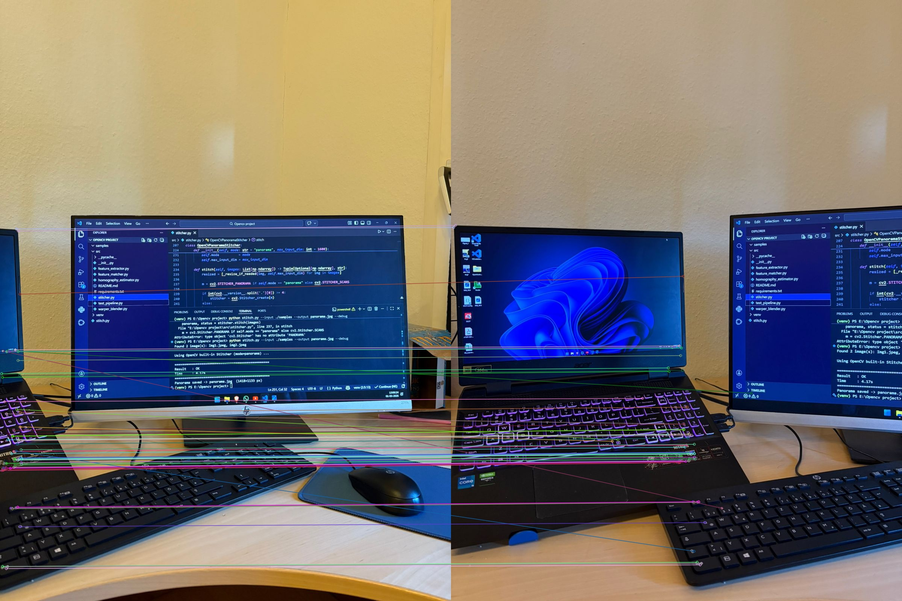

<div align="center">

# 🔍 Multi‑Scale Feature Detection and Matching Using OpenCV

### A modular, research-grade pipeline for panoramic image stitching
### using SURF / SIFT feature detection with RANSAC homography estimation

[](https://python.org)
[](https://opencv.org)
[](https://numpy.org)
[](LICENSE)
[](tests/)

</div>

---

## 📌 Table of Contents

- [Overview](#-overview)
- [Key Takeaways](#-key-takeaways)
- [Features](#-features)
- [Sample Inputs & Output](#-sample-inputs--output)
- [Project Structure](#-project-structure)
- [Installation](#-installation)
- [Quick Start](#-quick-start)
- [CLI Reference](#️-cli-reference)
- [Python API](#-python-api)
- [Algorithm Deep Dive](#-algorithm-deep-dive)
- [Running Tests](#-running-tests)
- [Tips for Best Results](#-tips-for-best-results)
- [License](#-license)

---

## 🧭 Overview

This project implements a complete **multi-scale feature detection and panoramic image stitching** pipeline using OpenCV. It supports two operational modes:

| Mode | Description | Best For |
|------|-------------|----------|
| `--mode custom` | SIFT + RANSAC custom pipeline | Educational use, wide-FOV rotational shots |
| `--mode opencv` | OpenCV built-in `cv2.Stitcher` | Phone photos, parallax scenes, production use |

The custom pipeline exposes every stage — feature extraction, matching, homography estimation, warping, and blending — as independent, reusable Python modules.

---

## 💡 Key Takeaways

> What this project taught about building real vision systems:

- **Multi-scale is non-negotiable** — single-scale detectors break the moment image resolution or zoom changes. Gaussian pyramids are what make SURF/SIFT work reliably in the wild.
- **Matching quality > quantity** — Lowe's ratio test filtering bad matches matters far more than the raw number of keypoints detected. A high inlier ratio after RANSAC is the true signal of a good match.
- **RANSAC is the robustness layer** — without it, even a few wrong correspondences can wildly distort the homography. The min inlier ratio threshold is the single most important knob to tune.
- **Blending is harder than stitching** — getting a geometrically correct panorama is step one. Getting a seamless one requires understanding frequency-domain blending (Laplacian pyramids) and seam placement.
- **Production != research** — handling large phone photos (auto-resize), OOM prevention (canvas clamping), non-blocking I/O, and fault-tolerant pipelines are what separate a working system from a working notebook.
- **Two modes for two realities** — the custom SIFT+RANSAC pipeline is transparent and educational; `cv2.Stitcher` handles bundle adjustment and exposure compensation automatically and is what you reach for in production.

---

## ✨ Features

| Stage | What It Does |
|-------|--------------|
| 🧩 **Feature Extraction** | SURF (fast, illumination-robust) with auto-fallback to SIFT |
| 🔭 **Scale Adaptivity** | Multi-octave Gaussian pyramid for robust detection across zoom levels |
| 🔗 **Feature Matching** | Brute-Force or FLANN with Lowe's ratio test (configurable threshold) |
| 🎯 **Outlier Rejection** | RANSAC homography estimation with inlier ratio filtering |
| 🖼️ **Perspective Warping** | Automatic canvas sizing with black-border cropping |
| 🎨 **Seam Blending** | Feather (Gaussian) or multi-band Laplacian pyramid blending |
| 🛠️ **Debug Mode** | Saves keypoint visualisations and match overlays to disk |
| 📐 **Auto Resize** | Downscales large phone photos before processing to prevent OOM |

---

## 🖼️ Sample Inputs & Output

### 📥 Input Images
> Two overlapping images placed in the `samples/` folder, captured with ~40% overlap.

```
samples/
├── img1.jpg        ← left image  (query)
└── img2.jpg        ← right image (train)
```

| Image 1 — Left | Image 2 — Right |
|----------------|-----------------|
|  |  |

```bash
# Command used
python stitch.py --input samples/img1.jpg samples/img2.jpg --output assets/panorama.jpg --debug
```

---

### 🔑 Keypoint Detection
> SIFT keypoints detected on both images — scale and orientation visualised (via `--debug`)

| Image 1 Keypoints | Image 2 Keypoints |
|-------------------|-------------------|
|  |  |

---

### 🔗 Feature Match Visualisation
> Lowe's ratio-filtered matches between Image 1 and Image 2



---

### 🌄 Final Stitched Output


> **Pipeline stats:**
> ```
> Images in    : 2  (img1.jpg + img2.jpg)
> Algorithm    : SIFT
> Keypoints    : 1,842  (img1)  |  1,756  (img2)
> Good matches : 312
> Inliers      : 278  (89.1%)
> Time         : 2.4s
> Output       : panorama.jpg  (3840×1080 px)
> ```

---

## 🏗️ Project Structure

```
multi-scale-feature-detection/
│
├── 📁 src/
│   ├── __init__.py               # Public API exports
│   ├── feature_extractor.py      # SURF / SIFT multi-scale extraction
│   ├── feature_matcher.py        # BF / FLANN + Lowe's ratio test
│   ├── homography_estimator.py   # RANSAC homography estimation
│   ├── warper_blender.py         # Perspective warp + feather/multiband blend
│   └── stitcher.py               # End-to-end orchestration pipeline
│
├── 📁 tests/
│   └── test_pipeline.py          # pytest unit + integration tests
│
├── 📁 samples/                   # Place your input images here
├── 📁 assets/                    # Output images for README display
│
├── stitch.py                     # 🚀 CLI entry point
├── requirements.txt              # Python dependencies
└── README.md
```

---

## ⚙️ Installation

### Prerequisites

- Python **3.8+**
- pip

### 1️⃣ Clone the repository

```bash
git clone https://github.com/YOUR_USERNAME/multi-scale-feature-detection.git
cd multi-scale-feature-detection
```

### 2️⃣ Install dependencies

```bash
pip install -r requirements.txt
```

### 3️⃣ (Optional) Enable SURF support

SURF is a **patented algorithm** and requires the non-free OpenCV modules:

```bash
pip uninstall opencv-python
pip install opencv-contrib-python>=4.8.0
```

> ℹ️ If SURF is unavailable, the pipeline automatically falls back to **SIFT** (open-source since OpenCV 4.4+).

---

## 🚀 Quick Start

```bash
# Stitch all images in a folder
python stitch.py --input ./samples --output panorama.jpg

# Stitch specific files
python stitch.py --input img_left.jpg img_centre.jpg img_right.jpg --output panorama.jpg

# OpenCV built-in stitcher (recommended for phone photos)
python stitch.py --input ./samples --output panorama.jpg --mode opencv

# High-quality multi-band blending
python stitch.py --input ./samples --output panorama.jpg --mode custom --blend multiband

# Debug mode — saves keypoint + match visualisations
python stitch.py --input ./samples --output panorama.jpg --debug
```

---

## 🖥️ CLI Reference

| Flag | Default | Description |
|------|---------|-------------|
| `--input` | *(required)* | Image file(s) or folder path |
| `--output` | `panorama.jpg` | Output file path |
| `--mode` | `opencv` | `opencv` (built-in) or `custom` (SIFT+RANSAC) |
| `--algorithm` | `AUTO` | `SURF`, `SIFT`, or `AUTO` |
| `--hessian-threshold` | `300` | SURF detector sensitivity (lower → more keypoints) |
| `--matcher` | `BF` | `BF` (brute-force) or `FLANN` (approximate, faster) |
| `--ratio-threshold` | `0.70` | Lowe's ratio test — lower is stricter |
| `--reproj-threshold` | `4.0` | RANSAC reprojection error threshold (pixels) |
| `--blend` | `feather` | `feather` (faster) or `multiband` (better seams) |
| `--feather-sigma` | `30.0` | Gaussian sigma for feather blending |
| `--pyramid-levels` | `4` | Laplacian pyramid levels for multi-band blending |
| `--max-input-dim` | `1600` | Resize input so largest dimension ≤ this (0 = off) |
| `--debug` | off | Save keypoint + match visualisation images |
| `--quiet` | off | Suppress all progress output |

---

## 🐍 Python API

### Basic usage

```python
import cv2
from src import PanoramaStitcher, StitchConfig

images = [cv2.imread(f) for f in ["left.jpg", "centre.jpg", "right.jpg"]]

stitcher = PanoramaStitcher()
panorama, report = stitcher.stitch(images)

print(f"Success  : {report.success}")
print(f"Algorithm: {report.algorithm_used}")
cv2.imwrite("panorama.jpg", panorama)
```

### Custom configuration

```python
config = StitchConfig(
    algorithm="SIFT",
    hessian_threshold=300,
    ratio_threshold=0.72,
    reproj_threshold=4.0,
    blend_method="multiband",
    pyramid_levels=5,
    max_input_dim=1200,
)
stitcher = PanoramaStitcher(config=config, verbose=True)
panorama, report = stitcher.stitch(images)
```

### Use individual components independently

```python
from src import (
    ScaleAdaptiveFeatureExtractor,
    FeatureMatcher,
    RANSACHomographyEstimator,
)

extractor    = ScaleAdaptiveFeatureExtractor(algorithm="AUTO")
matcher      = FeatureMatcher(method="BF", ratio_threshold=0.75)
ransac       = RANSACHomographyEstimator(reproj_threshold=5.0)

feat_a       = extractor.extract(img_a)
feat_b       = extractor.extract(img_b)
match_result = matcher.match(feat_a, feat_b)
hom_result   = ransac.estimate(match_result)

print(f"Keypoints A : {len(feat_a.keypoints)}")
print(f"Good matches: {len(match_result.good_matches)}")
print(f"Inliers     : {hom_result.n_inliers} ({hom_result.inlier_ratio:.1%})")
```

---

## 🔬 Algorithm Deep Dive

### Pipeline Overview

```
  📷 Input Images
        │
        ▼
  ┌─────────────────────────┐
  │   Scale-Adaptive         │  SURF (Hessian detector)
  │   Feature Extraction     │  or SIFT (DoG detector)
  │   (Multi-octave pyramid) │  → keypoints + 64/128-d descriptors
  └────────────┬────────────┘
               │
               ▼
  ┌─────────────────────────┐
  │   Feature Matching       │  BF or FLANN k-NN (k=2)
  │   + Lowe's Ratio Test    │  → filters ambiguous matches
  └────────────┬────────────┘
               │
               ▼
  ┌─────────────────────────┐
  │   RANSAC Homography      │  Estimates 3×3 H matrix
  │   Estimation             │  → rejects geometric outliers
  └────────────┬────────────┘
               │
               ▼
  ┌─────────────────────────┐
  │   Perspective Warping    │  warpPerspective with auto
  │   + Canvas Sizing        │  canvas expansion & OOM guard
  └────────────┬────────────┘
               │
               ▼
  ┌─────────────────────────┐
  │   Seam Blending          │  Feather (Gaussian weighted)
  │                          │  or Multi-band (Laplacian pyramid)
  └────────────┬────────────┘
               │
               ▼
         🌄 Panorama Output
```

### 🧬 SURF vs SIFT

| Property | SURF | SIFT |
|----------|------|------|
| ⚡ Speed | Faster (integral images) | Slower (DoG pyramid) |
| 📐 Scale invariant | ✅ | ✅ |
| 🔄 Rotation invariant | ✅ | ✅ |
| 💡 Illumination robust | ✅ Strong | ✅ Good |
| 📜 Licence | Non-free (patented) | Open (since OpenCV 4.4) |
| 📏 Descriptor size | 64 floats | 128 floats |

---

## 🧪 Running Tests

```bash
pip install pytest
pytest tests/ -v

# With coverage
pip install pytest-cov
pytest tests/ --cov=src --cov-report=term-missing
```

**Coverage includes:**
- ✅ Feature extractor — SIFT, AUTO fallback, grayscale input, invalid algorithm guard
- ✅ Feature matcher — BF matching, empty descriptors, invalid method guard
- ✅ RANSAC estimator — identity homography, too-few-matches failure path
- ✅ Warper & blender — canvas sizing, feather blend, multi-band blend
- ✅ Full pipeline — single image passthrough, two-image stitch, custom config

---

## 💡 Tips for Best Results

| Tip | Details |
|-----|---------|
| 📐 **Overlap** | Consecutive images should overlap by **30–50%** |
| 💡 **Exposure** | Keep consistent exposure and white balance across all shots |
| 🎯 **Camera motion** | Rotate around the nodal point — avoid lateral translation |
| ↔️ **Ordering** | Pass images left-to-right (or top-to-bottom) in capture order |
| 🔧 **Tuning** | Stitching failed? Lower `--hessian-threshold` or raise `--ratio-threshold` |
| 📱 **Phone photos** | Use `--mode opencv` — handles bundle adjustment and parallax |
| 🐛 **Debugging** | Use `--debug` to inspect keypoint and match quality visually |

---

## 📄 License

This project is licensed under the **MIT License** — see the [LICENSE](LICENSE) file for details.

---

<div align="center">

Made with ❤️ using Python & OpenCV

⭐ **If this project helped you, consider giving it a star!**

</div>
